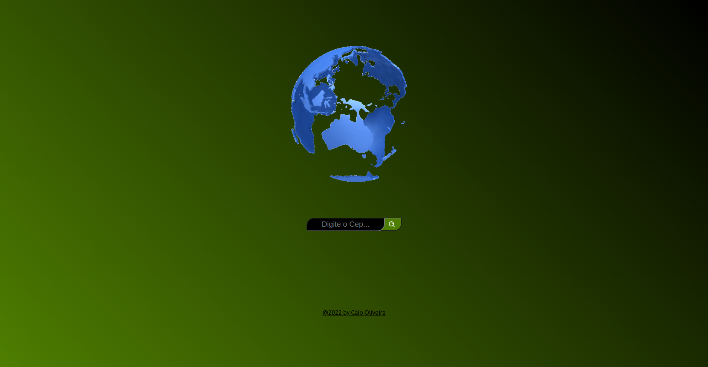

#  Create React App

Este projeto foi inicializado com [Create React App](https://github.com/facebook/create-react-app).

## Sobre

Vamos criar um aplicativo usando a API pública do Via Cep.

### Características

 - Pesquisar Cep
 - Apresenta endereço ligado ao CEP

### Bibliotecas

- [axios](https://www.npmjs.com/package/axios)
- [styled-components](https://styled-components.com/)

### Visualização

