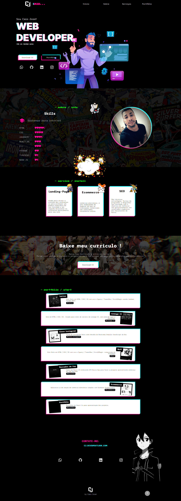

#  Create React App

Este projeto foi inicializado com [Create React App](https://github.com/facebook/create-react-app).

## Sobre

Este repositório foi criado para expor código do Portifólio

### Bibliotecas

- [node-sass](https://www.npmjs.com/package/node-sass)
- [react-icons](https://react-icons.github.io/)
- [framer-motion](https://www.framer.com/motion/)
- [use-Scroll](https://www.framer.com/docs/use-scroll/)
- [react-intersection-observer](https://www.npmjs.com/package/react-intersection-observer)
### Visualização

